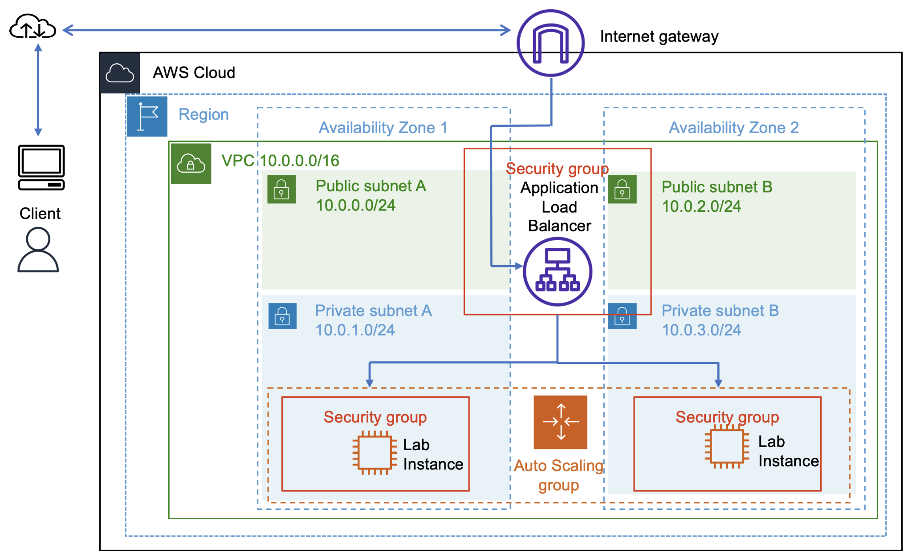

# 0600 Scaling and load balancing (ALB + Auto Scaling + CloudWatch)

These are my notes + screenshots from the **Scaling and Load Balancing Your Architecture** lab.

## What I built
- Created an **AMI** from an existing web server, so Auto Scaling could launch identical instances.
- Created an **Application Load Balancer (ALB)** and a **target group**.
- Created a **Launch Template** (AMI + instance type + security group).
- Created an **Auto Scaling Group** in **private subnets across two Availability Zones** (min 2, desired 2, max 4).
- Configured **target tracking scaling** to keep **Average CPU utilization ~ 50%**.

## Flow (how the services work together)
Client → **ALB** → EC2 instances (in **Auto Scaling Group**) → metrics to **CloudWatch** → alarms trigger **Auto Scaling** policies → more/less EC2 instances.

## What I learned
- ALB handles traffic distribution + health checks; Auto Scaling handles capacity.
- Target tracking scaling creates two CloudWatch alarms (scale out / scale in) automatically.
- The ASG can scale out under load and keep instances spread across multiple AZs for availability.

## Architecture

## Evidence
Screenshots are in the `evidence/` folder.

- Load test generating high CPU: `evidence/01-load-test-high-cpu.png`
- CloudWatch alarms (AlarmHigh/AlarmLow): `evidence/02-cloudwatch-alarms.png`
- ASG reached max capacity (4 instances): `evidence/03-asg-desired-capacity-4.png`
- EC2 shows 4 instances running across AZs: `evidence/04-ec2-instances-4-running.png`
